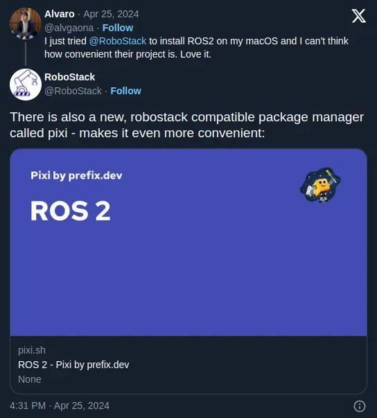

import Video from '@/components/Video';
import { Info, Tags } from 'lucide-react';
import Tldr from '@/components/tldr.astro';

<h5 class="mb-3 text-sm">{frontmatter.description}</h5>

# {frontmatter.title}

  

    <Tags size={16} />
    

      {frontmatter.tags.map((t) => (
        <a href={`/tags?value=${t}`}>
          # {t}
        </a>
      ))}
    

  

<Tldr>
    During my time at the Laboratory of Artificial Intelligence and Robotics (LINAR) as part of the research team,
    a very good friend of mine had told me about RoboStack when we were struggling to install ROS distributions
    on our personal machines and in our cluster of servers with GPU support.
    A couple years ago it was extremely daunting to install ROS in any of the supported operating systems;
    in particular, Ubuntu distributions were the mainly supported OS at the time and it still remains that way.
    Ubuntu is probably the first distribution that you mostly everyone will install on their very first days of using a Linux distribution,
    and I think it's the right way to go, it's easy to set up and the UX/UI is good enough.
    However, as you start becoming a more advanced user you will see that it has many limitations.
    I believe the most annoying "feature" of Ubuntu is that its dependencies get old, and many of them are fixed to the
    Ubuntu distribution.
    This is the case for Python and ROS, and two technologies came to help us here: RoboStack, and pyenv.
</Tldr>

## RoboStack

Open Robotics created this project called RoboStack to bundle ROS packages and make it available on multiple platforms:

1. Linux
2. Mac
3. Windows

It's backed by [Conda](https://conda.org) and all the features this package manager provides.
I have to recognize the hard work that's been put into it.
It's paved the way for the better package managers, but
it was a too slow for me, and buggy at the time.
It's possible the team has improved the performance and solved many bugs but I haven't come back to using conda directly.
To me it was no surprise RoboStack leveraged Conda to install another package manager called [Mamba](https://mamba.readthedocs.io).
This cross-platform package manager is the one that is used to install any ROS distribution in any OS.
This was mind blowing to me when we tested this in the laboratory, we could have the latest ROS distribution
on Ubuntu 2021 for instance, and even so, multiple ROS distributions on the same machine.
This was possible as there is this concept of isolated environments that you could activate and deactivate.
This feature is nowadays extremely useful for people in other fields such as signal processing, data science, and so on.

## What's wrong with Conda

Actually, there's nothing wrong about Conda, this project is actively being developed and maintained.
However, at this point I think the train has passed to make it the mainstream package manager out there, as
it's lacking most of the "cool" features other package managers have.

But Conda Channels do have to keep existing because this is primarily the core concept and mostly
everyone is leveraging this to build cool stuff; we have to keep supporting them.

## And Mamba

We can consider Mamba the fast alternative to Conda, and it is actually.
Its interface is very similiar, if not the same, as Conda.
Nothing else to say here but since it tries to follow its predecessor, I don't think
they'll add features and give a better UX than Conda already provides, the primary goal
is to make it faster.
So if I had to choose one of them, I'd definitely go for Mamba every time - maybe even to its minimal
version, [Micromamba](https://mamba.readthedocs.io/en/latest/user_guide/micromamba.html).

## What then

A couple months ago I was considering working on some robotics-related project, and I tried to do this
with RoboStack.
I posted on X about how easy it had been to set it up on any platform, and I received a comment from @RoboStack.

This is when I found out about [Pixi](https://pixi.sh).
In the Python ecosystem I was a heavy user of Poetry and Poetry solves a lot of issues and provides projects
with isolated virtualenvs with a lockfile - and much more - making it reproducible.
Although, it's not so fast and sometimes it gets tricky to solve dependencies but it does the work.

Pixi, on the other hand, is very similar but much faster! One of the reasons is that it's written completely in
Rust. Lately, the right language to build tooling.
To me, the pioneers at this approach were people in the JavaScript/TypeScript ecosystem that realized about this and make it
work great; one example is the bundler called [Turbopack](https://turbo.build/pack/docs).
I'm glad other communities are following this approach.

Additionally, it's based and inspired by Conda/Mamba and Poetry, respectively.
It's the better package manager at this time as it merges these two worlds with great success.

<Video
  client:load
  ratio={16 / 9}
  url="https://pub-9f1fe13d7d3744ac9ba1c96fb5a148d0.r2.dev/pixi-ekf-mono-slam.webm"
/>

## Final thoughts

I won't go over all the [Pixi features](https://pixi.sh/latest/features/environment) but I can't be more than
happy to have encountered this package manager.
It's no secret it captivated me by making ROS' instalation extremely fast and easy.
Nonetheless, there's this inherent potential for Pixi to become the number one package manager for the C/C++ community.
Yes, it's 2024 and there's never been a good package manager to install C/C++ dependencies, in probably 50 years!
I strongly believe in Pixi and I think not many people in the C/C++ community know about this package manager and I think
the Prefix team has to penetrate more in this community by showcasing the power of this tool in all the venues possible.
It's also super important to explain about the power of project-based environments and environments
in general to the younger generation, this will certainly make their lives easier and there will be less friction to
start coding what really matters to them.
